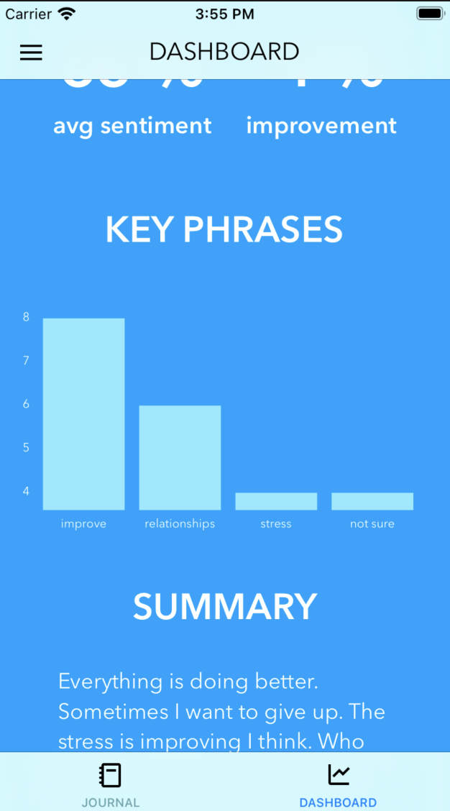
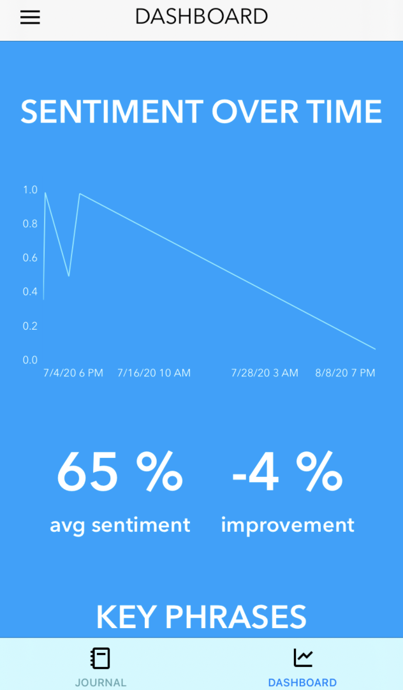
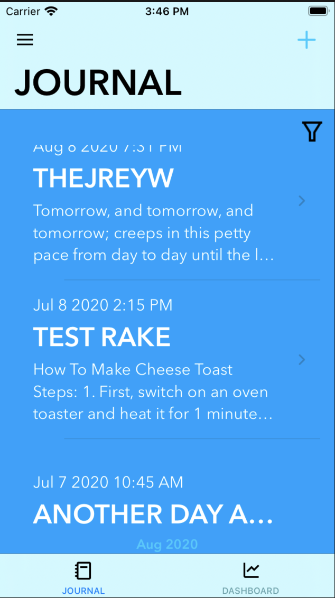
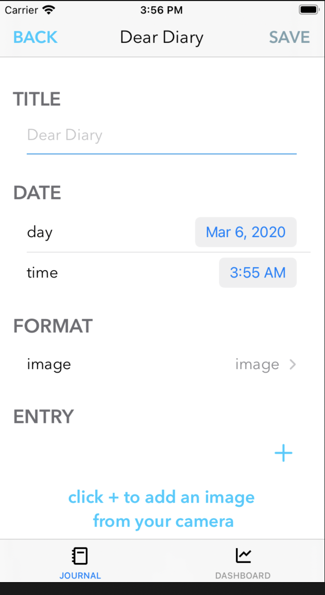
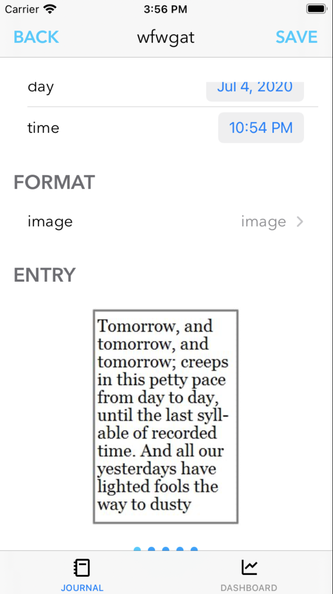
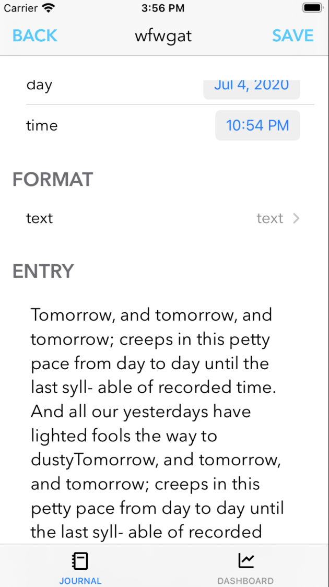

#  float note
### an AI dashboard for your digital and handwritten journal all in one place



## about 
<p> Democratize mental healthcare. Get a 360 view of how you are doing - just by writing in your journal as you usually do. You can add entries by typing or by taking a pictures of handwritten entries. The image is converted to text and all of the entries get analyzed using NLP/AI. Then they are presented in a visual dashboard. For example "sentiment", a measure of postivity verses negativity, is displayed over time in the line graph. The top key words from you journal are also extracted and displayed in the bar graph. etc. </p>
<p> I made this app because I wanted to make something that would help my friends manage their stress and mental health. I also wanted to learn how to make a mobile app and how to build and deploy an app from the ground up. </p>
The back ends: 
- https://github.com/mickeybarcia/float_note_ml_api
- https://github.com/mickeybarcia/float-note-server

## run locally
```
# use QA build
pod install
```
## tools used
- SwiftUI
- Alamofire networking
- Swift Charts 
## resources
- https://medium.com/yay-its-erica/making-a-hamburger-slide-out-menu-in-swift-3-ef5249b6693e
- https://medium.com/@abhimuralidharan/adding-settings-to-your-ios-app-cecef8c5497
- https://dev.to/kevinmaarek/forms-made-easy-with-swiftui-3b75
- https://morioh.com/p/c0b400f40cfc
- https://medium.com/better-programming/combine-swiftui-with-alamofire-abb4cd4a0aca
- https://medium.com/better-programming/implement-imagepicker-using-swiftui-7f2a28caaf9c
- https://stackoverflow.com/questions/58896661/swiftui-create-image-slider-with-dots-as-indicators
- https://medium.com/better-programming/meet-greet-list-pagination-in-swiftui-8330ee15fd61
- https://medium.com/flawless-app-stories/simplify-swiftui-accessibility-with-one-modifier-to-rule-them-all-198ba7cc6392
- https://dev.to/bsorrentino/develop-a-textfield-validator-for-swiftui-7d3
- https://www.swiftbysundell.com/articles/caching-in-swift/
